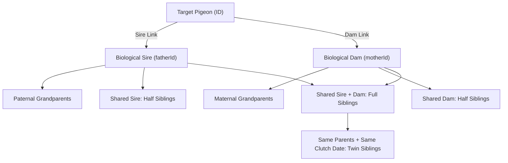
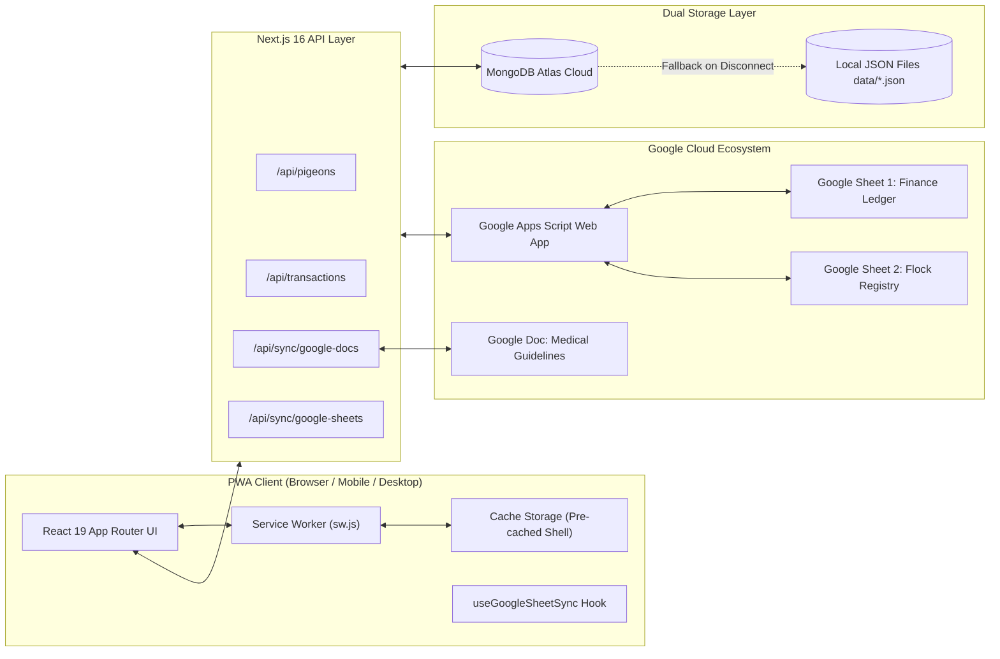

<div align="center">

# 🕊️ Himel's Pet House ERP
### Enterprise Pigeon Farm, Loft & Genetic Genealogy Management System

[](https://nextjs.org/)
[](https://react.dev/)
[](https://www.typescriptlang.org/)
[](https://tailwindcss.com/)
[](https://himel-agro-erp.vercel.app)
[](https://docs.google.com)
[](https://docs.google.com)
[](https://himel-agro-erp.vercel.app)

**A mission-critical, enterprise-grade avian ERP engineered for bloodline genealogy, multi-generational pedigree tracking, bidirectional Google Sheets & Google Docs synchronization, Progressive Web App (PWA) offline operation, breeding pair optimization, health schedules, feed inventory, and lifetime financial accounting.**

[Live Production ERP](https://himel-agro-erp.vercel.app) • [Architecture](#-system-architecture) • [Google Cloud Sync](#-connected-google-cloud-ecosystem-2-sheets--1-doc) • [PWA Capabilities](#-progressive-web-app-pwa-features) • [Module Guide](#-module-by-module-walkthrough) • [Getting Started](#-getting-started) • [Contact](#-certified-loft-contact)

---

</div>

## 📑 Table of Contents

- [📌 Overview](#-overview)
- [✨ Key Capabilities](#-key-capabilities)
- [☁️ Connected Google Cloud Ecosystem (2 Sheets + 1 Doc)](#-connected-google-cloud-ecosystem-2-sheets--1-doc)
- [📱 Progressive Web App (PWA) Features](#-progressive-web-app-pwa-features)
- [📦 Module-by-Module Walkthrough](#-module-by-module-walkthrough)
  - [1. Executive Dashboard](#1-executive-dashboard-dashboard)
  - [2. Pigeon Flock Registry](#2-pigeon-flock-registry-pigeons)
  - [3. Pigeon Dossier & Pedigree Engine](#3-pigeon-dossier--pedigree-engine-pigeonsid)
  - [4. Breeding Center & Pair Management](#4-breeding-center--pair-management-breeding)
  - [5. Health & Medical Protocol](#5-health--medical-protocol-health)
  - [6. Feed Inventory & Warehouse Stock](#6-feed-inventory--warehouse-stock-feed)
  - [7. Financial Accounting & Accounts Ledger](#7-financial-accounting--accounts-ledger-finance)
  - [8. System Settings & Cloud Integrations](#8-system-settings--cloud-integrations-settings)
- [🧬 Deterministic Kinship & Pedigree Calculation](#-deterministic-kinship--pedigree-calculation)
- [🏷️ Physical Ring Standard & Identifiers](#-physical-ring-standard--identifiers)
- [🏗️ System Architecture & Data Flow](#-system-architecture--data-flow)
- [🔌 API Routes Reference](#-api-routes-reference)
- [⚙️ Environment Variables](#-environment-variables)
- [💻 Getting Started & Local Development](#-getting-started--local-development)
- [📍 Certified Loft Contact](#-certified-loft-contact)

---

## 📌 Overview

**Himel's Pet House ERP** is a full-featured avian resource planning and loft genetics platform custom-built for high-performance pigeon lofts, commercial breeders, and racing enthusiasts. Managing champion bloodlines (such as **Giribaz highflyers & tumblers** and **Racing Homers**) requires precise recordkeeping across bloodlines, physical band allocations, breeding clutches, medical doses, feeding velocity, and finances.

This ERP connects directly with **Google Sheets** (2 separate workbooks for finances and pigeons) and **Google Docs** (live medical guidelines) via automated 2-way real-time synchronization, while providing a fully installable **Progressive Web App (PWA)** that operates offline in the loft with zero data loss.

---

## ✨ Key Capabilities

| Capability | Description |
| :--- | :--- |
| **Bidirectional Google Sheets Sync** | Full 2-way CRUD: creates, updates, and deletes in ERP mirror immediately in Google Sheets; edits/deletions in Sheets automatically reconcile into the ERP upon sync. |
| **Real-Time Google Docs Sync** | Dedicated real-time sync engine auto-polling health and medicine protocols from Google Docs every 30 seconds. |
| **Progressive Web App (PWA)** | 1-click install on Android, iOS Safari, macOS, and Windows. Offline service worker precaching with dedicated offline fallback page. |
| **3-Tier Financial Intelligence** | Sequenced financial overviews: **Current Active Month** $\rightarrow$ **Current Calendar Year (2026)** $\rightarrow$ **From Beginning to Today Date (2019–Present)**. |
| **Genetic Kinship Traversal** | Deterministic calculations resolving parents, full siblings, half-siblings, twins, grandparents, and extended family without circular loop vulnerabilities. |
| **Official PDF Pedigrees** | Instant browser-generated landscape A4 pedigree certificates and portrait comprehensive dossiers with certified loft seal. |
| **Dual Storage Fallback** | Production-ready MongoDB Atlas database paired with transparent local JSON storage (`data/*.json`) for complete offline resilience. |
| **Zero Layout Shift (CLS)** | Custom Tailwind CSS Skeleton UI mirroring all page layouts during background revalidation and synchronization. |

---

## ☁️ Connected Google Cloud Ecosystem (2 Sheets + 1 Doc)

The application integrates with **three distinct Google Cloud documents** grouped neatly inside a collapsible **"Google Sheets & Docs"** dropdown in the navigation sidebar:

```text
Sidebar Navigation
└── 📁 Google Sheets & Docs (Collapsible Dropdown)
    ├── 📊 Sheet 1: Finance Ledger (Google Sheets)
    ├── 🕊️ Sheet 2: Flock Registry (Google Sheets)
    └── 📄 Medical Guidelines (Google Docs)
```

### 1. Sheet 1: Finance & Accounts Ledger
- **URL**: [Open Google Sheet 1: Finance Ledger](https://docs.google.com/spreadsheets/d/1w894o27P0eF4Sgt59l11_VfW995Y3pLwO77mB8Jk2sQ/edit)
- **Tabs**: `BUY` (expenses), `SELL` (sales income), `Exchange`, and monthly summary sheets (`2019-2025`, `May`, `June`, `July`, `August`, `September`).
- **Functionality**:
  - Pushes newly registered transactions (bird sales, feed purchases, medicine orders).
  - Synchronizes historical setup costs (2019–2025 foundation capital: `৳100,000`).
  - Auto-calculates active calendar year operating profit and cumulative lifetime position.

### 2. Sheet 2: Pigeon Flock Registry
- **URL**: [Open Google Sheet 2: Flock Registry](https://docs.google.com/spreadsheets/d/1B3Nn_t2E18w80F53gYnIqYfB7n1Y0wK9_tZt5F9N4_U/edit)
- **Target Data**: Official flock census for allocated physical ring bands (Rings `01` through `15`).
- **Bidirectional Deletion Parity**:
  - When a pigeon is deleted in the ERP, a `DELETE_PIGEON` webhook permanently removes that row in Google Sheet.
  - When rows are deleted directly inside Google Sheet, the ERP sync engine detects the missing rows and purges them from MongoDB and local storage, ending active breeding pairs associated with the deleted birds.

### 3. Google Doc: Live Medicine & Health Guidelines
- **URL**: [Open Google Doc: Medicine Guidelines](https://docs.google.com/document/d/1ly7mM86pcpKNdR5IlxVJXY_zsssEpaHP7wy7CeFN1f0/edit?usp=sharing)
- **Live Sync Engine (`/api/sync/google-docs`)**:
  - The ERP periodically pulls exported plaintext from Google Docs every 30 seconds.
  - Changes made in the Google Doc are detected via hash comparison and updated in real time.
  - Embedded in the `/health` module with a live status indicator, last-synced timestamp, and manual "Sync Now" button.

---

## 📱 Progressive Web App (PWA) Features

Himel's Pet House ERP is a fully compliant Progressive Web App meeting all Google Chrome, Edge, and Apple Web App standards:

1. **Standalone Installation**:
   - **Desktop**: Click **"Install App"** in the sidebar or the address bar install icon.
   - **Android**: 1-click install prompt from the sidebar button.
   - **iOS Safari**: Native banner explaining `Share` $\rightarrow$ `Add to Home Screen`.
2. **Service Worker (`public/sw.js`)**:
   - **Pre-Caching Shell**: Pre-caches key application navigation routes (`/`, `/dashboard`, `/pigeons`, `/breeding`, `/health`, `/feed`, `/finance`, `/settings`, `/offline`, logo, and icons).
   - **Network-First Navigation with Offline Fallback**: In the event of network disruption in the loft, navigation requests serve cached shells or the dedicated offline page (`/offline`).
   - **Stale-While-Revalidate**: Instant page loads for static assets, scripts, stylesheets, and images.
3. **Multi-Resolution Responsive Icons (`public/icons/`)**:
   - High-density square and maskable icons: `72x72`, `96x96`, `128x128`, `144x144`, `152x152`, `192x192`, `384x384`, `512x512`.
   - Android adaptive maskable icon: `icon-maskable-512x512.png`.
   - Apple Touch Icon (`180x180`): `apple-touch-icon.png`.
4. **PWA Context & Online/Offline Toasts**:
   - `components/pwa/PwaProvider.tsx` listens to browser network connectivity events (`online`/`offline`) and renders notification banners.

---

## 📦 Module-by-Module Walkthrough

### 1. Executive Dashboard (`/dashboard`)
The central command console for loft operations:
- **Loft Master Welcome Banner**: Displays certified farm emblem, owner details (`Mehedi Hasan Himel`), primary contact number, and live census badge (`Live Loft • 22 Kept Birds`).
- **Quick Action Buttons**: Instant access to `+ Register Pigeon`, `Form Pair`, and official contact channels (WhatsApp, Facebook Page, Google Maps Loft Location).
- **Flock Census KPI Grid (6 Cards)**:
  1. **Kept Birds**: Active birds residing in the loft (`22` active / `24` total historical).
  2. **Racers**: Racing Homer lines count (`10`).
  3. **Giribaz**: Highflyers and tumblers count (`12`).
  4. **Hens**: Active breeding and racing females (`11`).
  5. **Cocks**: Active breeding and racing males (`11`).
  6. **Lost Rings**: Allocated rings recorded as lost (Rings `04` and `14`).
- **Live Flock Registry Centerpiece Widget**:
  - Real-time synchronized roster of banded pigeons (Rings `01` to `15`).
  - **Foundation Bloodline Filter**: Quick filtering by *Dhaka Blue Bar Line*, *Sherpur Maxi Line*, *Chuina Kajkora Line*, *Musaldom Highflyer Line*, and *Chila & Gola Line*.
  - **Category Tabs**: Filter between *All Rings*, *Kept Birds*, *Racers*, *Giribaz*, *Hens*, *Cocks*, and *Lost Rings*.
  - Instant live search by ring, breed, pattern, parent notes, and color.
  - In-row navigation to single pigeon dossier (`Profile`) and lineage tree (`Tree`).
- **3-Tier Sequenced Financial Intelligence**:
  1. **Current Monthly Financial Overview**: Highlights current active month (`September 2026`), operating income from bird sales, ongoing feed/medicine costs, and monthly net margin (`৳`).
  2. **Current Year Financial Overview**: Calendar year `2026` operational overview, tracking YTD revenue, YTD expenses, operating margin across active operational months (`Jan – Sep 2026`), and monthly average cost (`৳`).
  3. **From Beginning to Today Date Financial Overview**: Lifetime financial overview capturing initial infrastructure setup investment (`৳100,000` from 2019–2025) alongside 2026 operational expenses to show total lifetime balance.
- **Daily Operations & Inventory Management**:
  - **Medicine Due Widget**: Medication doses and vaccines scheduled for today, plus upcoming treatment courses.
  - **Feed Stock Alerts Widget**: Grain warehouse inventory levels (kg) with low-stock warnings when inventory drops below safety thresholds.
- **Recent Activity & Commercial Records**:
  - **Recent Breeding Clutches**: Clutches, pair IDs, round numbers, lay dates, hatch dates, and egg/hatch ratio badges.
  - **Preserved Pigeon Sales**: Commercial sale history with buyer names, dates, ring badges, and prices in BDT.

---

### 2. Pigeon Flock Registry (`/pigeons`)
The complete registry of all birds registered in the system:
- **Category Filter Tabs**:
  - **All**: Displays all recorded pigeons.
  - **Male (Cock)**: Filters strictly to active males.
  - **Female (Hen)**: Filters strictly to active females.
  - **Baby (Squab)**: Filters young unweaned/weaned squabs.
  - **Ring Lost**: Specifically tracks pigeons where physical band tags were lost or compromised.
  - **Pigeon Lost**: Specifically tracks pigeons lost during flight, training, or racing.
- **Dual Display Modes**:
  - **Organic Grid View**: 16:10 visual cards showing photos, ring badges, breed, color, sex badge, Sire/Dam shortcuts, and sale price.
  - **Tabular View**: Data-dense table with sorting, multi-select checkboxes for bulk deletion, status badges, and quick action menus.
- **Search & Advanced Filtering**: Filter by hatch year, breed type, status, or search free text across ring numbers, parents, and color patterns.

---

### 3. Pigeon Dossier & Pedigree Engine (`/pigeons/[id]`)
Comprehensive single-pigeon dossier and bloodline analysis:
- **Hero Identification Header**: Physical ring band badge, status badge, sex badge, hatch date, and age calculation.
- **Physical Characteristics**: Eye sign, color pattern, strain, loft location, and commercial pricing.
- **Deterministic Biological Kinship Traversal**:
  - **Biological Sire (Father)** & **Biological Dam (Mother)** with direct profile navigation.
  - **Full Siblings** (same father & mother).
  - **Half Siblings** (shared father or shared mother).
  - **Twin Siblings** (same parents, identical clutch date).
  - **Grandparents & Extended Relatives**.
- **Interactive Multi-Generational Pedigree Tree (`/pigeons/[id]/pedigree`)**:
  - Visual 4-generation pedigree tree with lineage pathways.
- **Official Export & Printing Engine**:
  - **Landscape Pedigree Certificate (A4 PDF)**: Official certified pedigree document with watermark, certified loft seal, ancestor traits, and QR verification link.
  - **Portrait Comprehensive Dossier (A4 PDF)**: Complete dossier with physical metrics, pedigree ancestry table, vaccination history, and loft master signature line.

---

### 4. Breeding Center & Pair Management (`/breeding`, `/breeding/pairs`)
Genetic pairing and incubation management:
- **Active Pair Serial Numbering**: Active pairs are allocated clean, deterministic serial numbers (`#01`, `#02`, `#03`...) that stay consistent throughout the app.
- **Pair Formation Modal**: Pair compatible Cocks and Hens with loft/cage numbering, target pairing purpose, and pairing dates.
- **Breeding Rounds Tracker**:
  - Clutch dates (Egg 1 laid, Egg 2 laid).
  - Incubation milestones & fertility candling.
  - Hatch date and hatched baby count.
  - Squab ring banding: Assign newly hatched babies to physical rings directly from the round.
  - Automated hatch rate calculation (`%`).

---

### 5. Health & Medical Protocol (`/health`)
Preventive health care and flock treatment:
- **Live Google Doc Medical Guidelines Integration**:
  - Embedded live guidelines widget pulling directly from the official Google Doc.
  - Displays last sync timestamp, connection status, and manual sync button.
- **Treatment Course Manager**:
  - Plan medication schedules for whole loft flock or individual pigeons.
  - Record medicine name, purpose (e.g. Paramyxovirus vaccine, Worming, Canker/Trichomoniasis, Respiratory, Vitamins), dosage, and treatment period.
- **Daily Due Reminders**: Automated alerts flagging doses due today.

---

### 6. Feed Inventory & Warehouse Stock (`/feed`)
Feed stock monitoring and grain consumption:
- **Grain Inventory Ledger**: Monitor stock levels for Mixed Grain, Millet (Bajra), Corn/Maize, Green Peas (Dabli), Wheat, and Mineral Grit.
- **Purchase Logs**: Log incoming feed purchases with quantity (kg), supplier, and cost.
- **Daily Usage Tracking**: Log daily consumption across loft sections.
- **Low Stock Warnings**: Threshold alerts highlighting grains that require immediate replenishment.

---

### 7. Financial Accounting & Accounts Ledger (`/finance`)
Complete double-entry commercial and operational accounting:
- **Transaction Types**: `INCOME` (pigeon sales, breeding fees), `EXPENSE` (feed, medicine, loft maintenance, ring bands), and `EXCHANGE`.
- **Monthly Financial Summaries**: Auto-aggregated revenue, operational expense, and profit/loss by calendar month.
- **Historical Capital Setup Accounting**: Maintains foundation setup investment (`৳100,000` for 2019–2025) separate from active operational margins.
- **Direct Synchrony with Google Sheet 1**: All transactions sync with the `BUY` and `SELL` tabs in Google Sheets.

---

### 8. System Settings & Cloud Integrations (`/settings`)
Administrative controls and cloud connections:
- **Certified Loft Branding**: Edit farm name, loft master name, phone number, WhatsApp, Facebook URL, and Google Maps link.
- **Google Sheets & Docs Integrations**:
  - Manage Google Apps Script deployment URL.
  - Manage Google Sheets spreadsheet URLs.
  - Manage Google Docs guidelines URL.
- **Manual Data Resynchronization**: Force cloud synchronization across all endpoints.

---

## 🧬 Deterministic Kinship & Pedigree Calculation

Kinship relationships are calculated deterministically in [`lib/calculations/kinshipCalculator.ts`](file:///Users/macbookair/Documents/projects%20/himel-agro-erp/lib/calculations/kinshipCalculator.ts):



- **Loop Prevention**: Ancestry graph resolution tracks visited IDs in a `Set<string>` to prevent recursive loops.
- **Graceful Unregistered Handling**: If a parent is cited by physical ring string rather than database ID, the engine resolves the parent by ring number matching.

---

## 🏷️ Physical Ring Standard & Identifiers

Himel's Pet House ERP enforces a certified physical ring structure:

$$\mathbf{YYYY \mid SS \mid Farm \mid Contact}$$

```text
┌─────────────────────────────────────────────────────────────┐
│ 2026 | 01 | Himel's Pet House | 01560059954                │
└─────────────────────────────────────────────────────────────┘
  │      │    │                   │
  │      │    │                   └─ Primary Loft Contact
  │      │    └───────────────────── Certified Loft Brand Name
  │      └────────────────────────── 2-Digit Serial Ring Number (01–15)
  └───────────────────────────────── Hatch / Registration Year
```

- **Canonical Database Identifier**: Generated automatically as `YYYY-SS-BreedCode-SexCode` (e.g., `2026-01-GSM` for Year 2026, Ring 01, Giribaz Sabuj Gola, Male).

---

## 🏗️ System Architecture & Data Flow



---

## 🔌 API Routes Reference

| Endpoint | Methods | Description |
| :--- | :--- | :--- |
| `/api/dashboard` | `GET` | Consolidated metrics, flock statistics, active pairs, and recent transactions |
| `/api/pigeons` | `GET`, `POST` | List all pigeons (with category filters) / Register new pigeon |
| `/api/pigeons/[id]` | `GET`, `PUT`, `DELETE` | View pigeon dossier / Update details / Delete pigeon with remote sheet sync |
| `/api/pairs` | `GET`, `POST` | List active & past breeding pairs / Create mating pair |
| `/api/pairs/[id]` | `GET`, `PUT`, `DELETE` | View pair details / Update pair status / End pair |
| `/api/breeding-rounds` | `GET`, `POST` | List breeding rounds / Log new clutch and incubation milestones |
| `/api/breeding-rounds/[id]`| `GET`, `PUT`, `DELETE`| Update round / Delete round |
| `/api/health-records` | `GET`, `POST` | Disease and treatment log entries |
| `/api/medicine-schedules` | `GET`, `POST` | List medication schedules / Create new medical course |
| `/api/medicine-schedules/[id]`| `GET`, `PUT`, `DELETE`| Update / Delete medication schedule |
| `/api/feed-purchases` | `GET`, `POST` | Feed inventory purchase logs |
| `/api/feed-usage` | `GET`, `POST` | Daily feed consumption logs |
| `/api/transactions` | `GET`, `POST` | Financial ledger list (with month/type filter) / Create transaction |
| `/api/transactions/[id]` | `GET`, `PUT`, `DELETE` | Update / Delete transaction with remote sheet sync |
| `/api/sync/google-sheets` | `POST` | Triggers bidirectional Google Sheets synchronization |
| `/api/sync/google-sheets/push` | `POST` | Webhook endpoint receiving remote Google Sheet edit notifications |
| `/api/sync/google-docs` | `GET`, `POST` | Fetches live Google Doc guidelines / Forces re-sync |
| `/api/settings` | `GET`, `PUT` | View loft settings / Update branding & integration endpoints |

---

## ⚙️ Environment Variables

Create or configure your `.env.local` file:

```env
# Google Apps Script Web App Execution Endpoint
NEXT_PUBLIC_GOOGLE_SHEETS_SCRIPT_URL="https://script.google.com/macros/s/AKfycbzU4871CsSjuimWX2oRG5pqpgWokFsK4Hhjd6EPr6YcsOwVA-knV9fexscWrRO-eofLTg/exec"

# Target Google Spreadsheet URL (Finance Ledger & Buy/Sell Sheets)
NEXT_PUBLIC_GOOGLE_SHEETS_URL="https://docs.google.com/spreadsheets/d/1w894o27P0eF4Sgt59l11_VfW995Y3pLwO77mB8Jk2sQ/edit"

# Target Google Spreadsheet URL (Flock Registry 01-15)
NEXT_PUBLIC_GOOGLE_PIGEONS_SHEET_URL="https://docs.google.com/spreadsheets/d/1B3Nn_t2E18w80F53gYnIqYfB7n1Y0wK9_tZt5F9N4_U/edit"

# Target Google Document URL (Medicine & Health Guidelines)
NEXT_PUBLIC_GOOGLE_DOCS_URL="https://docs.google.com/document/d/1ly7mM86pcpKNdR5IlxVJXY_zsssEpaHP7wy7CeFN1f0/edit?usp=sharing"

# MongoDB Database Connection String (Optional; transparently falls back to local data/*.json store)
MONGODB_URI="mongodb+srv://<username>:<password>@cluster.mongodb.net/himel-agro-erp?retryWrites=true&w=majority"
```

---

## 💻 Getting Started & Local Development

### Prerequisites
- **Node.js**: v18.18.0+ (Node.js 20+ LTS recommended)
- **npm**: v9+ (or `pnpm` / `yarn`)

### Quick Setup

1. **Clone the repository**:
   ```bash
   git clone https://github.com/Mehedi-Hasan-Himel/himel-agro-erp.git
   cd himel-agro-erp
   ```

2. **Install project dependencies**:
   ```bash
   npm install
   ```

3. **Configure Environment Variables**:
   ```bash
   cp .env.example .env.local
   # Fill in your .env.local credentials
   ```

4. **Launch the Development Server**:
   ```bash
   npm run dev
   ```

5. **Access the application**:
   Open [http://localhost:3000](http://localhost:3000) in your browser.

### Key Maintenance Scripts

```bash
# Start Turbopack development server
npm run dev

# Run TypeScript type-checker without emitting files (verify 0 errors)
npx tsc --noEmit

# Run Next.js production build verification
npm run build

# Start production server
npm run start

# Run ESLint linter
npm run lint
```

---

## 📍 Certified Loft Contact

- **Certified Loft Brand**: **Himel's Pet House**
- **Loft Master & Owner**: **Mehedi Hasan Himel**
- **Official Loft Phone**: `+880 1560059954`
- **WhatsApp**: [Chat with Loft Master (+8801560059954)](https://wa.me/8801560059954)
- **Facebook Official Page**: [facebook.com/Himel.Pet.House](https://www.facebook.com/Himel.Pet.House)
- **Loft Location**: [Himel's Pet House on Google Maps](https://maps.app.goo.gl/rxvdsxq8ydnqfEKQ6)
- **Live Production URL**: [https://himel-agro-erp.vercel.app](https://himel-agro-erp.vercel.app)

---

<div align="center">
  <p>© 2026 Himel's Pet House. Crafted with precision for champion breeders and high-performance pigeon aviaries.</p>
</div>
