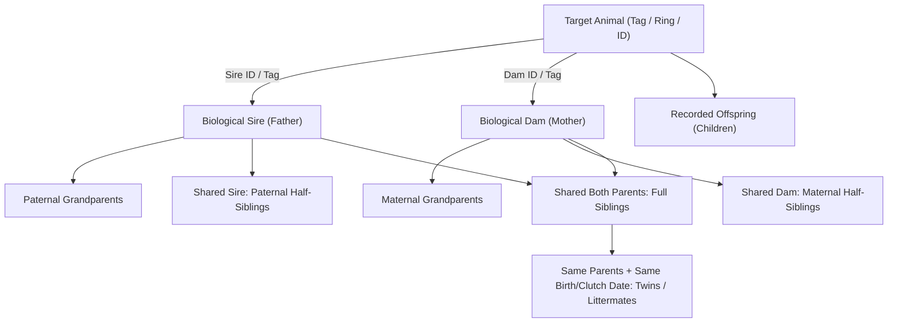

<div align="center">

# 🌾 Himel's Pet House ERP
### Scalable Multi-Animal Farming & Livestock Genetics Management System

[](https://nextjs.org/)
[](https://react.dev/)
[](https://www.typescriptlang.org/)
[](https://tailwindcss.com/)
[](https://himel-agro-erp.vercel.app)
[](#-multi-animal-sector-architecture)
[](https://docs.google.com)
[](https://docs.google.com)
[](https://himel-agro-erp.vercel.app)

**A mission-critical, enterprise-grade multi-animal agricultural ERP engineered for livestock bloodline genealogy, multi-generational pedigree tracking, gestation monitoring, bidirectional Google Cloud synchronization, Progressive Web App (PWA) offline operation, health protocols, feed warehouse management, and multi-sector financial accounting.**

[Live Production ERP](https://himel-agro-erp.vercel.app) • [Multi-Sector Architecture](#-multi-animal-sector-architecture) • [Module Guide](#-module-by-module-walkthrough) • [Kinship Engine](#-deterministic-kinship--pedigree-engine) • [Google Cloud Sync](#-connected-google-cloud-ecosystem-2-sheets--1-doc) • [Developer Guide: Adding Sectors](#-developer-guide-adding-new-animal-sectors) • [Contact](#-certified-farm-contact)

---

</div>

## 📑 Table of Contents

- [📌 Overview](#-overview)
- [✨ Key Enterprise Capabilities](#-key-enterprise-capabilities)
- [🐐 Multi-Animal Sector Architecture](#-multi-animal-sector-architecture)
  - [Central Sector Registry (`lib/config/sectors.ts`)](#central-sector-registry-libconfigsectorsts)
  - [Global Sector Selector & Context (`SectorContext.tsx`)](#global-sector-selector--context-sectorcontexttsx)
  - [Dynamic Navigation Bar](#dynamic-navigation-bar)
- [📦 Module-by-Module Walkthrough](#-module-by-module-walkthrough)
  - [1. Executive Dashboard](#1-executive-dashboard-dashboard)
  - [2. Pigeon Farming Sector (Loft & Genetics)](#2-pigeon-farming-sector-loft--genetics)
  - [3. Goat Farming Sector (Herd & Dairy/Meat)](#3-goat-farming-sector-herd--dairymeat)
  - [4. Multi-Sector Financial Accounting](#4-multi-sector-financial-accounting-finance)
  - [5. System Settings & Cloud Integrations](#5-system-settings--cloud-integrations-settings)
- [🧬 Deterministic Kinship & Pedigree Engine](#-deterministic-kinship--pedigree-engine)
- [🏷️ Animal Identification Standards](#-animal-identification-standards)
- [☁️ Connected Google Cloud Ecosystem (2 Sheets + 1 Doc)](#-connected-google-cloud-ecosystem-2-sheets--1-doc)
- [📱 Progressive Web App (PWA) Features](#-progressive-web-app-pwa-features)
- [🔌 API Routes Reference](#-api-routes-reference)
- [🚀 Developer Guide: Adding New Animal Sectors](#-developer-guide-adding-new-animal-sectors)
- [⚙️ Environment Variables](#-environment-variables)
- [💻 Getting Started & Local Development](#-getting-started--local-development)
- [📍 Certified Farm Contact](#-certified-farm-contact)

---

## 📌 Overview

**Himel's Pet House ERP** is a full-featured agricultural and livestock resource planning system. Originally built as an elite pigeon genetics and loft management platform, the system has been architecturally evolved into a **modular, multi-animal farming ERP**.

The system natively supports two active farming sectors:
1. **🕊️ Pigeon Farming Sector**: Racing Homers, Giribaz highflyers, ring band numbering (`01`–`15`), clutch incubation, and loft genetics.
2. **🐐 Goat Farming Sector**: Black Bengal, Jamunapari, Boer, and Sirohi herds, ear tag identification (`HA-GT-XX`), weight trajectories, gestation milestones, kidding logs, and forage feed management.

### Extensible Design
The system's core architecture avoids brittle, hard-coded species conditionals. All sector terminology, navigation, capabilities, and metrics are driven by a centralized configuration engine. New livestock sectors—such as **🐄 Cow / Cattle**, **🐔 Chicken / Poultry**, **🐃 Buffalo**, **🐑 Sheep**, and **🐟 Fish / Aquaculture**—can be plugged in seamlessly with zero refactoring to core shared services.

---

## ✨ Key Enterprise Capabilities

| Capability | Description |
| :--- | :--- |
| **Config-Driven Sectors** | Switch between individual animal sectors or operate in **Combined View Mode** to run macro-level farm analytics across all animals. |
| **Generic Kinship Engine** | High-performance graph traversal calculating Sires, Dams, Full Siblings, Maternal/Paternal Half-Siblings, Twins/Littermates, Grandparents, and Offspring without circular recursion. |
| **Multi-Sector Finance** | Every transaction is attributed to a specific sector (`PIGEON`, `GOAT`, or `SHARED`). Features interactive Cross-Sector Performance Comparison and period filtering. |
| **Gestation & Clutches** | Sector-specific reproductive tracking: egg candling & clutch incubation for birds, ultrasound & 150-day gestation countdowns for ruminants. |
| **Official PDF Pedigrees** | Instant browser-rendered landscape A4 pedigree certificates and portrait comprehensive dossiers with certified farm branding. |
| **Bidirectional Google Sheets Sync** | 2-way live sync with Google Sheets (Finance Ledger and Flock Census) via webhook events and reconciliation engines. |
| **Real-Time Google Docs Sync** | Auto-polling medical guidelines from Google Docs with hash-based change detection. |
| **Progressive Web App (PWA)** | Offline service worker precaching (`himel-agro-erp-v2`) with network-first fallback, local JSON persistence fallback, and standalone installation. |

---

## 🐐 Multi-Animal Sector Architecture

The application is structured around a central separation between **Animal Sectors** and **Shared Farm Systems**:

```text
                             HIMEL'S PET HOUSE ERP
                                       │
                    ┌──────────────────┴──────────────────┐
                    │                                     │
             Animal Sectors                         Shared Systems
                    │                                     │
         ┌──────────┴──────────┐            ┌─────────────┼─────────────┐
         │                     │            │             │             │
      🕊️ Pigeon             🐐 Goat      💰 Finance    ☁️ Cloud Sync  ⚙️ Settings
         │                     │
   (Loft & Bands)       (Herd & Tags)
         │                     │
         ▼                     ▼
   Future Animals        Future Animals
 (Cow, Chicken, etc.)  (Sheep, Buffalo, etc.)
```

### Central Sector Registry (`lib/config/sectors.ts`)
Each sector is defined by an `AnimalSectorConfig` declaration specifying:
- **Identification & Branding**: `id`, `key`, `name`, `displayName`, `icon`, `color`, `badgeClass`.
- **Terminology Mapping**: Specific names for animals (`bird`/`goat`), males (`Cock`/`Buck`), females (`Hen`/`Doe`), offspring (`Squab`/`Kid`), tags (`Ring Band`/`Ear Tag`), housings (`Loft`/`Barn`), and lineage (`Pedigree`/`Ancestry Tree`).
- **Feature Capabilities**: Toggles for `pedigree`, `kinship`, `breedingRounds`, `gestationTracking`, `eggTracking`, `weights`, `milkProduction`, and `flightRecords`.
- **Navigation Items**: Dynamically generated sidebar routes matching the sector's active capabilities.

```typescript
// Example snippet from lib/config/sectors.ts
export const ANIMAL_SECTORS: Record<AnimalSectorId, AnimalSectorConfig> = {
  PIGEON: {
    id: 'PIGEON',
    displayName: 'Pigeon',
    icon: '🕊️',
    enabled: true,
    capabilities: { pedigree: true, kinship: true, eggTracking: true, ... },
    // ...
  },
  GOAT: {
    id: 'GOAT',
    displayName: 'Goat',
    icon: '🐐',
    enabled: true,
    capabilities: { pedigree: true, kinship: true, gestationTracking: true, weights: true, ... },
    // ...
  },
  // Placeholders ready for immediate activation:
  COW: { id: 'COW', displayName: 'Cow / Cattle', icon: '🐄', enabled: false, ... },
  CHICKEN: { id: 'CHICKEN', displayName: 'Chicken / Poultry', icon: '🐔', enabled: false, ... },
};
```

### Global Sector Selector & Context (`SectorContext.tsx`)
The `SectorContext` provider wraps the entire application:
- **State Persistence**: Persists user sector preferences in browser `localStorage`.
- **Single Sector Mode**: Focus on one species (e.g., only Pigeon or only Goat).
- **Combined View Mode**: Toggle all sectors at once for full executive oversight.
- **SSR-Safe Hydration**: Seamlessly renders on the server and synchronizes on client hydration with zero layout shift.

### Dynamic Navigation Bar
The sidebar (`components/layout/Sidebar.tsx`) automatically adapts:
1. **Farming Sector Switcher**: Interactive checkboxes for `🕊️ Pigeon` and `🐐 Goat`, plus a `Combined View` toggle.
2. **Dynamic Quick Actions**: Quick buttons (`+ Pigeon`, `+ Goat`) based on active sectors.
3. **Sector-Grouped Menus**: Dedicated navigation sections for **Pigeon Sector** and **Goat Sector**, dynamically expanding or contracting depending on the active sector filters.
4. **Shared Operations**: Unified links for **Finance & Ledger**, **Google Sheets & Docs** dropdown, and **Settings**.

---

## 📦 Module-by-Module Walkthrough

### 1. Executive Dashboard (`/dashboard`)
The central operations console dynamically renders according to the active sector selection:
- **Combined View Mode**: Displays the **Multi-Sector Executive Header** with macro farm inventory (total combined livestock, monthly farm revenue, active breeding dams/clutches, and feed alerts) plus cross-sector performance cards.
- **Pigeon Mode**: Renders the complete Pigeon Command Center with 6-card flock census (Kept Birds, Racers, Giribaz, Hens, Cocks, Lost Rings), Foundation Bloodline roster, incubation clutches, and feed alerts.
- **Goat Mode**: Renders the **Goat Operational Dashboard** with herd census (Bucks, Does, Kids, Castrated Wethers), gestation countdowns for pregnant does, daily forage inventory (Napier grass, Straw, Mash), and immunization schedules.

---

### 2. Pigeon Farming Sector (Loft & Genetics)

- **Flock Registry (`/pigeons`)**:
  - Filter by status, sex (Cock/Hen), squabs, lost rings, and flight loss.
  - Organic grid view with high-res photos and tabular view with multi-select bulk operations.
  - Search by ring number, foundation strain, pattern, and color.
- **Dossier & Genealogy (`/pigeons/[id]`)**:
  - Ring band metadata, eye sign, plumage, physical characteristics, and commercial valuation.
  - Deterministic kinship resolution (Sire, Dam, Full Siblings, Half-Siblings, Clutch Twins).
- **4-Generation Pedigree Tree (`/pigeons/[id]/pedigree`)**:
  - Interactive multi-generational lineage chart.
  - Print-ready certified A4 PDF exports (Landscape Certificate and Portrait Dossier).
- **Breeding Center (`/breeding`, `/breeding/pairs`)**:
  - Deterministic pair serial numbers (`#01`, `#02`, `#03`...).
  - Incubation milestones, fertility candling, hatch rate calculations, and direct squab band allocation.
- **Avian Health Protocol (`/health`)**:
  - Treatment schedule planner (Paramyxovirus, Canker, Deworming, Respiratory, Vitamins).
  - Real-time synchronization with the official Google Doc medical guide.
- **Grain Inventory (`/feed`)**:
  - Warehouse stock management for mixed grain, bajra, corn, wheat, dabli peas, and mineral grit.

---

### 3. Goat Farming Sector (Herd & Dairy/Meat)

- **Herd Registry (`/goats`)**:
  - Comprehensive herd census filtering across *All*, *Bucks (Breeding Males)*, *Does (Breeding Females)*, *Kids (Young)*, *Wethers (Meat/Castrated)*, and *Sold/Archived*.
  - Dual view modes: Visual card grid with ear tags, breed, sex, weight, and status; or data-dense tabular view.
- **New Goat Registration (`/goats/new`)**:
  - Smart form with auto-generated ear tag numbers (`HA-GT-XX`).
  - Fields for microchip/RFID, breed (Black Bengal, Jamunapari, Boer, Sirohi, Cross), horn status (Horned, Polled, Disbudded), coat color, birth type (Single, Twin, Triplet), birth weight, current weight, and parental assignment.
- **Goat Dossier & Kinship (`/goats/[id]`)**:
  - Complete profile displaying ear tag hero badge, production purpose (Breeding, Meat, Dairy), weight history, and maternal/paternal biological pedigree.
  - Deterministic kinship traversal identifying biological sire, dam, twin siblings/littermates, full siblings, and offspring.
- **Ancestry Tree & Pedigree Certificate (`/goats/[id]/pedigree`)**:
  - Multi-generational genealogical tree diagram tracking ancestry lines.
  - Official printable A4 certificate with farm seal and pedigree certification details.
- **Reproductive Center & Gestation Countdown (`/goats/breeding`)**:
  - Mating logs pairing bucks and does with targeted breeding dates.
  - **150-Day Gestation Tracker**: Real-time progress bar, days elapsed, days remaining, and estimated kidding due date.
  - Kidding outcome logging: birth counts, live kids born, birth weights, and litter registration.
- **Herd Immunization & Veterinary Protocol (`/goats/health`)**:
  - Protocols for Peste des Petits Ruminants (PPR), Enterotoxemia (ET), Tetanus, Goat Pox, Foot and Mouth Disease (FMD), and quarterly Ivermectin deworming.
  - Quarantine management, withdrawal periods, and treatment cost tracking.
- **Forage & Concentrate Inventory (`/goats/feed`)**:
  - Stock levels for Green Forage (Napier, Para grass), Dry Roughage (Rice Straw), Concentrate Mash, and Mineral Salt Lick blocks.
  - Minimum stock threshold monitoring with real-time depletion warnings.

---

### 4. Multi-Sector Financial Accounting (`/finance`)

Unified commercial double-entry ledger with multi-sector intelligence:
- **Sector Attribution**: Every transaction is tagged with its origin:
  - `🕊️ Pigeon`: Bird sales, squab bookings, pigeon feed, loft accessories, and bands.
  - `🐐 Goat`: Goat meat/live sales, kid bookings, Napier/fodder purchases, and goat veterinary costs.
  - `🏡 Shared Farm`: Electricity, farm land rent, general labor, and infrastructure maintenance.
- **Sector Filter Bar**: Instant ledger filtering by *All Sectors*, *Pigeon Only*, *Goat Only*, or *Shared Only*.
- **Cross-Sector Performance Comparison**: Live comparative analytics displaying total income, operational expenses, and net margin side-by-side for each sector.
- **3-Tier Financial Sequenced Overview**:
  1. **Current Month Overview**: Real-time monthly revenue, operating cost, and net profit.
  2. **Active Calendar Year Overview**: Year-to-date operating performance and monthly burn rates.
  3. **Cumulative Lifetime Position**: Captures historical farm setup capital (`৳100,000` foundation investment) alongside ongoing operations.
- **Transaction Modal with Sector Selector**: Easy modal for creating transactions with pre-configured category options matching the chosen sector.

---

### 5. System Settings & Cloud Integrations (`/settings`)

- **Farm & Brand Identity**: Configure farm brand name, owner name (`Mehedi Hasan Himel`), primary contact phone, WhatsApp link, Facebook page URL, and physical farm address.
- **Google Cloud Endpoints**: Inspect and update Google Apps Script web app URL, Google Sheets URLs, and Google Docs guidelines URL.
- **Manual Cloud Sync**: One-click manual synchronization forcing bidirectional data parity with remote Google Sheets.

---

## 🧬 Deterministic Kinship & Pedigree Engine

All animal lineage traversal is powered by the unified generic kinship engine in [`lib/calculations/genericKinshipCalculator.ts`](file:///Users/macbookair/Documents/projects%20/himel-agro-erp/lib/calculations/genericKinshipCalculator.ts):



### Key Engine Guarantees:
- **Zero Circular Recursion**: Uses `Set<string>` cycle detection to protect against accidental circular parental references in user data.
- **Dual Identifier Resolution**: Resolves parents by either internal database `id` or physical ring band / ear tag string.
- **Twin & Littermate Intelligence**: Automatically flags siblings sharing both parents and an identical birth/clutch date as twins or littermates.
- **Polymorphic Compatibility**: Implements `BaseAnimal`, allowing the same engine to calculate pedigrees for pigeons, goats, cattle, or any future livestock.

---

## 🏷️ Animal Identification Standards

| Sector | Identifier Format | Physical Marking | Example |
| :--- | :--- | :--- | :--- |
| **🕊️ Pigeon** | `YYYY-SS-BreedCode-SexCode` | Seamless aluminum ring band (`01`–`15`) | `2026-01-GSM` (Year 2026, Ring 01) |
| **🐐 Goat** | `HA-GT-XX` | Visual ear tag + RFID/Microchip | `HA-GT-01` (Sultan, Black Bengal Buck) |
| **🐄 Cow (Planned)** | `HA-CW-XX` | Large double ear tag + RFID button | `HA-CW-01` |
| **🐔 Chicken (Planned)** | `HA-CK-XX` | Wing band / Spiral leg band | `HA-CK-01` |

---

## ☁️ Connected Google Cloud Ecosystem (2 Sheets + 1 Doc)

The application communicates with Google Cloud services grouped under the **"Google Sheets & Docs"** dropdown in the navigation sidebar:

```text
Sidebar Navigation
└── 📁 Google Sheets & Docs (Dropdown)
    ├── 📊 Sheet 1: Finance Ledger (Google Sheets)
    ├── 🕊️ Sheet 2: Flock Registry (Google Sheets)
    └── 📄 Medical Guidelines (Google Docs)
```

1. **Google Sheet 1: Finance Ledger**:
   - [Open Google Sheet 1: Finance Ledger](https://docs.google.com/spreadsheets/d/1w894o27P0eF4Sgt59l11_VfW995Y3pLwO77mB8Jk2sQ/edit)
   - Synchronizes `BUY`, `SELL`, `Exchange`, and monthly summary sheets (`2019-2025`, `May`, `June`, `July`, `August`, `September`).
   - Automatically attributes transactions with their proper sector tags.
2. **Google Sheet 2: Flock Registry**:
   - [Open Google Sheet 2: Flock Registry](https://docs.google.com/spreadsheets/d/1B3Nn_t2E18w80F53gYnIqYfB7n1Y0wK9_tZt5F9N4_U/edit)
   - Official census for physical ring bands (`01` through `15`).
   - Full 2-way deletion parity: deletions in the ERP trigger Google Sheet row deletions; deletions in Google Sheet automatically purge from the ERP on sync.
3. **Google Doc: Medical & Health Guidelines**:
   - [Open Google Doc: Medicine Guidelines](https://docs.google.com/document/d/1ly7mM86pcpKNdR5IlxVJXY_zsssEpaHP7wy7CeFN1f0/edit?usp=sharing)
   - Real-time polling engine (`/api/sync/google-docs`) checks for guideline updates every 30 seconds via hash comparison.

---

## 📱 Progressive Web App (PWA) Features

The application is an installable Progressive Web App engineered for harsh, low-connectivity farm environments:
- **Service Worker (`public/sw.js`)**: Upgraded to cache version `himel-agro-erp-v2`. Pre-caches core routes for both Pigeon and Goat sectors (`/`, `/dashboard`, `/pigeons`, `/goats`, `/breeding`, `/health`, `/feed`, `/finance`, `/settings`, `/offline`).
- **Offline Storage Resilience**: Dual-layer architecture: MongoDB Atlas in the cloud with an automatic, transparent fallback to local JSON stores (`data/*.json`).
- **Standalone Mode**: 1-click installation on Android, iOS Safari (via Add to Home Screen), macOS, and Windows.
- **Connectivity Detection**: Real-time toast notifications alerting users when network drops or reconnects.

---

## 🔌 API Routes Reference

### Pigeon & Breeding APIs
| Endpoint | Methods | Description |
| :--- | :--- | :--- |
| `/api/pigeons` | `GET`, `POST` | List pigeons with filtering / Register new pigeon |
| `/api/pigeons/[id]` | `GET`, `PUT`, `DELETE` | View dossier / Update pigeon / Delete with remote sync |
| `/api/pairs` | `GET`, `POST` | List breeding pairs / Create mating pair |
| `/api/pairs/[id]` | `GET`, `PUT`, `DELETE` | View pair / Update status / End pair |
| `/api/breeding-rounds` | `GET`, `POST` | List rounds / Log new clutch and incubation milestones |
| `/api/breeding-rounds/[id]` | `GET`, `PUT`, `DELETE` | Update / Delete breeding round |

### Goat Sector APIs
| Endpoint | Methods | Description |
| :--- | :--- | :--- |
| `/api/goats` | `GET`, `POST` | List goats with status/sex/breed filters / Register new goat |
| `/api/goats/[id]` | `GET`, `PUT`, `DELETE` | View goat dossier / Update goat profile / Archive goat |
| `/api/goats/breeding` | `GET`, `POST` | List gestation and mating logs / Record new breeding log |
| `/api/goats/health` | `GET`, `POST` | List vaccination and treatment records / Log health event |
| `/api/goats/feed` | `GET` | List goat forage and concentrate inventory levels |

### Shared Operations & Cloud APIs
| Endpoint | Methods | Description |
| :--- | :--- | :--- |
| `/api/dashboard` | `GET` | Consolidated executive metrics, census, and alerts |
| `/api/transactions` | `GET`, `POST` | Multi-sector financial ledger (supports `?sector=PIGEON\|GOAT\|SHARED`) |
| `/api/transactions/[id]` | `GET`, `PUT`, `DELETE` | Update / Delete transaction with remote sheet sync |
| `/api/health-records` | `GET`, `POST` | Avian health treatment log entries |
| `/api/medicine-schedules` | `GET`, `POST` | Avian medication schedule manager |
| `/api/feed-purchases` | `GET`, `POST` | Feed warehouse purchase records |
| `/api/feed-usage` | `GET`, `POST` | Daily feed consumption logs |
| `/api/sync/google-sheets` | `POST` | Triggers bidirectional Google Sheets sync |
| `/api/sync/google-sheets/push` | `POST` | Webhook receiver for Google Sheets edits |
| `/api/sync/google-docs` | `GET`, `POST` | Real-time Google Doc guidelines sync |
| `/api/settings` | `GET`, `PUT` | View / update farm branding and integration endpoints |

---

## 🚀 Developer Guide: Adding New Animal Sectors

Adding a new farming sector (e.g. **🐄 Cow / Cattle** or **🐔 Chicken / Poultry**) requires zero changes to core shared engines:

### Step 1: Update Sector Configuration
Open [`lib/config/sectors.ts`](file:///Users/macbookair/Documents/projects%20/himel-agro-erp/lib/config/sectors.ts) and set `enabled: true`:

```typescript
COW: {
  id: "COW",
  key: "cow",
  name: "Cow / Cattle",
  displayName: "Cow",
  icon: "🐄",
  enabled: true, // <-- Flip to true
  // customize terminology, capabilities, and navigation links as desired
}
```

### Step 2: Define Data Model & Storage
1. Create `types/cow.ts` extending `BaseAnimal` from [`types/animal.ts`](file:///Users/macbookair/Documents/projects%20/himel-agro-erp/types/animal.ts).
2. Create MongoDB Mongoose model in `models/Cow.ts`.
3. Add initial seed data in `data/cows.json`.

### Step 3: Add API Route & UI
1. Create `app/api/cows/route.ts` and `app/api/cows/[id]/route.ts`.
2. Create UI pages in `app/cows/page.tsx` and `app/cows/[id]/page.tsx`.
3. Add `"COW"` to `FinanceSector` in [`types/finance.ts`](file:///Users/macbookair/Documents/projects%20/himel-agro-erp/types/finance.ts) to enable Cow sector financial ledger entries.

That's it! The **Global Sector Selector**, **Sidebar Navigation**, **Kinship Engine**, and **Multi-Sector Finance Comparison** will immediately incorporate the new sector automatically.

---

## ⚙️ Environment Variables

Create or configure your `.env.local` file:

```env
# Google Apps Script Web App Execution Endpoint
NEXT_PUBLIC_GOOGLE_SHEETS_SCRIPT_URL="https://script.google.com/macros/s/AKfycbzU4871CsSjuimWX2oRG5pqpgWokFsK4Hhjd6EPr6YcsOwVA-knV9fexscWrRO-eofLTg/exec"

# Target Google Spreadsheet URL (Finance Ledger & Buy/Sell Sheets)
NEXT_PUBLIC_GOOGLE_SHEETS_URL="https://docs.google.com/spreadsheets/d/1w894o27P0eF4Sgt59l11_VfW995Y3pLwO77mB8Jk2sQ/edit"

# Target Google Spreadsheet URL (Flock Registry 01-15)
NEXT_PUBLIC_GOOGLE_PIGEONS_SHEET_URL="https://docs.google.com/spreadsheets/d/1B3Nn_t2E18w80F53gYnIqYfB7n1Y0wK9_tZt5F9N4_U/edit"

# Target Google Document URL (Medicine & Health Guidelines)
NEXT_PUBLIC_GOOGLE_DOCS_URL="https://docs.google.com/document/d/1ly7mM86pcpKNdR5IlxVJXY_zsssEpaHP7wy7CeFN1f0/edit?usp=sharing"

# MongoDB Database Connection String (Optional; transparently falls back to local data/*.json store)
MONGODB_URI="mongodb+srv://<username>:<password>@cluster.mongodb.net/himel-agro-erp?retryWrites=true&w=majority"
```

---

## 💻 Getting Started & Local Development

### Prerequisites
- **Node.js**: v18.18.0+ (Node.js 20+ LTS recommended)
- **npm**: v9+ (or `pnpm` / `yarn`)

### Quick Setup

1. **Clone the repository**:
   ```bash
   git clone https://github.com/Mehedi-Hasan-Himel/himel-agro-erp.git
   cd himel-agro-erp
   ```

2. **Install dependencies**:
   ```bash
   npm install
   ```

3. **Configure Environment Variables**:
   ```bash
   cp .env.example .env.local
   ```

4. **Launch Development Server**:
   ```bash
   npm run dev
   ```

5. **Access Application**:
   Open [http://localhost:3000](http://localhost:3000) in your browser.

### Key Maintenance Scripts

```bash
# Start Next.js development server
npm run dev

# Run TypeScript type-checker (verify 0 errors)
npx tsc --noEmit

# Run Next.js production build verification
npm run build

# Start production server
npm run start

# Run ESLint linter
npm run lint
```

---

## 📍 Certified Farm Contact

- **Certified Farm Brand**: **Himel's Pet House**
- **Farm Master & Owner**: **Mehedi Hasan Himel**
- **Official Farm Phone**: `+880 1560059954`
- **WhatsApp**: [Chat with Farm Master (+8801560059954)](https://wa.me/8801560059954)
- **Facebook Official Page**: [facebook.com/Himel.Pet.House](https://www.facebook.com/Himel.Pet.House)
- **Farm Location**: [Himel's Pet House on Google Maps](https://maps.app.goo.gl/rxvdsxq8ydnqfEKQ6)
- **Live Production URL**: [https://himel-agro-erp.vercel.app](https://himel-agro-erp.vercel.app)

---

<div align="center">
  <p>© 2026 Himel's Pet House. Engineered with excellence for modern multi-animal agricultural enterprise and livestock genetics.</p>
</div>
